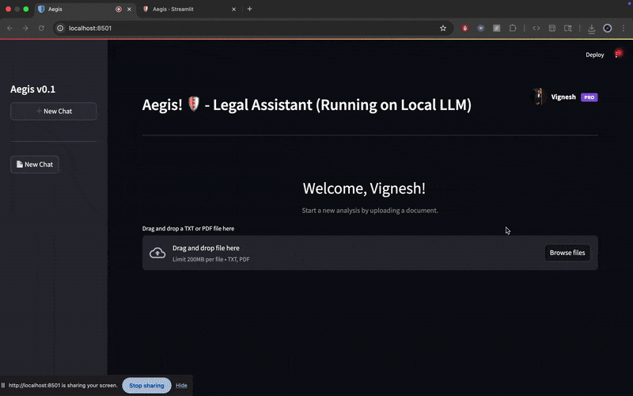
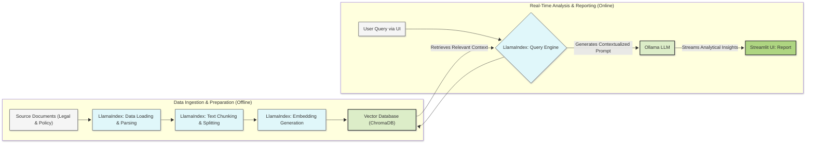

# ⚖️ AI Legal Document Analyzer

[](https://www.python.org/) [](https://streamlit.io/) [](https://www.llamaindex.ai/) [](https://ollama.com/)

A sophisticated RAG (Retrieval-Augmented Generation) system built to analyze legal documents like NDAs and B2B agreements for compliance risks. This tool leverages local LLMs to compare contract clauses against internal policies, providing real-time, streaming analysis to accelerate legal review cycles.

<br>



## The Problem

In any business setting, legal teams spend countless hours manually reviewing contracts. This process is:
* **Time-Consuming:** Manually reading dense legal text is slow.
* **Costly:** Legal hours are expensive.
* **Prone to Error:** Human oversight can lead to missed risks and non-compliant clauses.

This project tackles these challenges by automating the initial, repetitive stages of compliance review.

## Features

* **AI-Powered Clause Analysis:** Utilizes local, open-source LLMs (Llama 3 / Phi3) to understand and interpret complex legal language.
* **Retrieval-Augmented Generation (RAG):** The core of the system. It enriches the LLM's knowledge with custom internal policy documents, ensuring analysis is based on specific organizational rules, not just general knowledge.
* **Dynamic Risk Assessment:** Automatically flags clauses and assigns risk levels (Low, Medium, High) with justifications.
* **Interactive Frontend:** A clean, user-friendly interface built with Streamlit for easy document selection and analysis.
* **Real-Time Streaming:** The analysis report is streamed word-by-word, providing an interactive and responsive user experience.

## Tech Stack & Architecture

This project was built with a modern, open-source stack designed for building local-first LLM applications.

| Component | Technology | Description |
| :--- | :--- | :--- |
| **LLM Server** | **Ollama** | Serves open-source models like Llama 3 locally. |
| **RAG Framework** | **LlamaIndex** | Orchestrates the data pipeline from ingestion to retrieval and querying. |
| **Vector Database** | **ChromaDB** | Stores document embeddings for efficient similarity search. |
| **Web UI** | **Streamlit** | Creates the interactive user interface with Python. |
| **Language** | **Python** | The core programming language for the entire application. |

### System Architecture

The application follows a standard RAG pipeline:



### Local Setup & Installation
Follow these steps to run the project on your local machine.

Prerequisites
1. Python 3.10+
2. Ollama installed and running on your machine.

#### Step-by-Step Guide
1. Clone the Repository
Bash
    ```
    git clone [https://github.com/Vignesh-Thiagarajan-DS/AI-Privacy-Policy-Analyzer.git](https://github.com/Vignesh-Thiagarajan-DS/AI-Privacy-Policy-Analyzer.git)
    cd AI-Privacy-Policy-Analyzer
    ```
    
2. Create and Activate Virtual Environment
Bash
    ```
    python3 -m venv venv
    source venv/bin/activate
    ```
    
3. Install Dependencies
Bash
    ```
    pip install -r requirements.txt
    ```
    
4. Download a Local LLM via Ollama
Bash
    ```
    ollama pull phi3:mini
    ollama pull nomic-embed-text
    ```
    
5. Ingest Your Data
Bash
    ```
    python Codes/ingest.py
    ```
    
6. Run the Streamlit Application
Bash
    ```
    streamlit run Codes/app.py
    ```

#### Usage
1. Once the app is running, select a document from the dropdown menu.
2. Click the "Analyze Document" button.
3. Watch as the analysis is streamed to the results section in real-time.

#### License
---
This project is licensed under the MIT License. See the [LICENSE](LICENSE) file for details.
